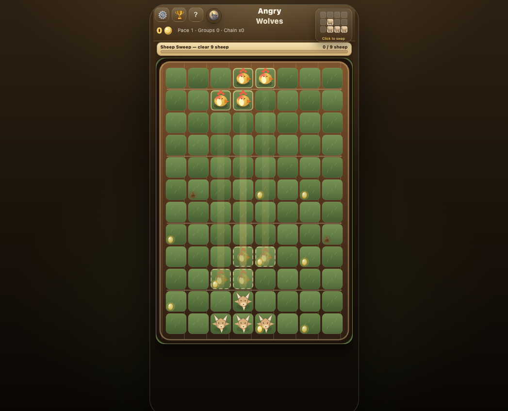
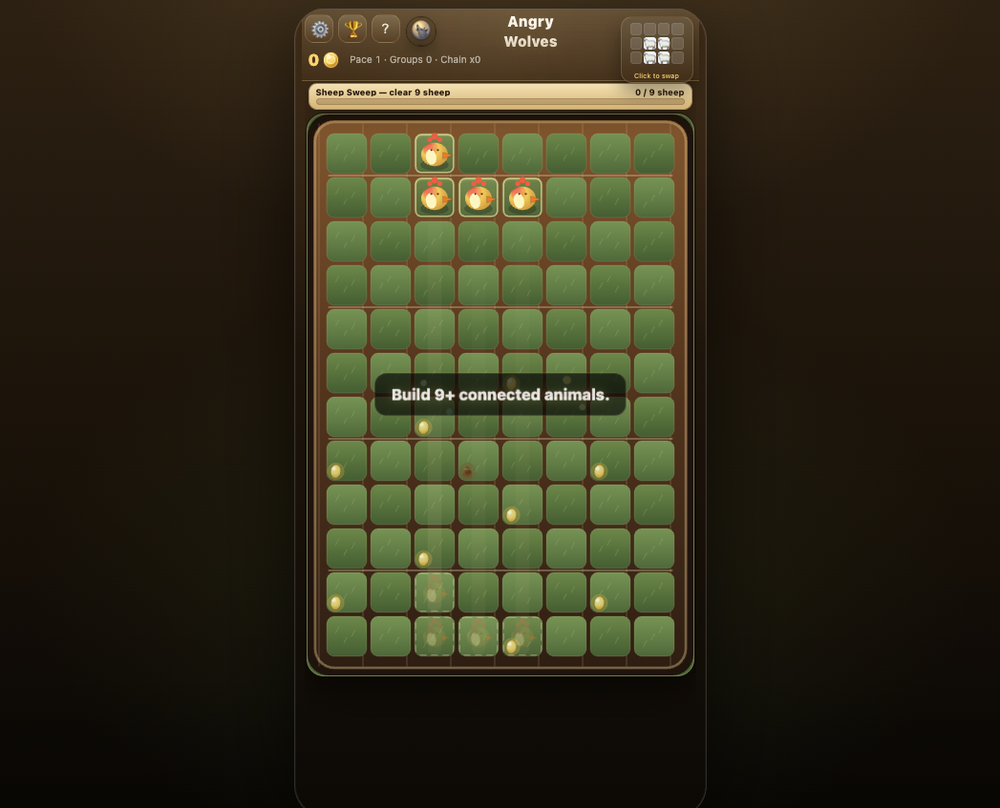
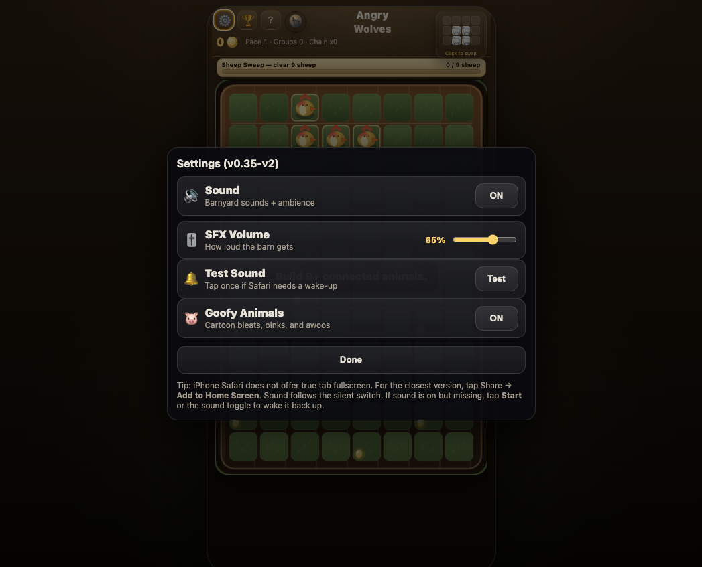
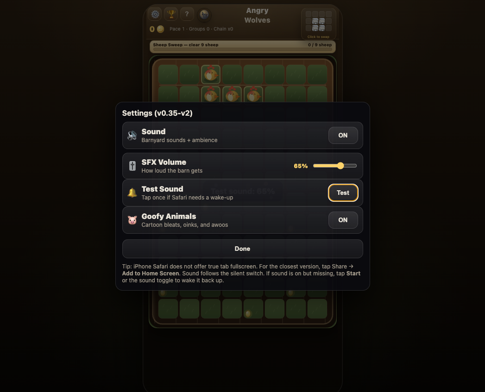

# Angry Wolves V2 Stability + Tuning Pass Report

Branch: `refresh/v2-barnyard-core`  
Date: 2026-04-26  
Scope: scoring stability, ghost/drop-lane readability, and iPhone audio reliability.  
Status: implemented locally for review only. Nothing was committed, merged, deployed, pushed to `main`, or changed in GitHub Pages settings.

## Executive Summary

This focused pass addressed three urgent V2 issues:

- Scoring was too volatile because eggs used exponential doubling (`2^eggCount`) and could create runaway payouts.
- The landing ghost/drop lane was too bright and visually competed with the active falling tetrad.
- iPhone audio could appear broken because missing SFX volume storage was being read as `0%`.

The fix keeps V2 fun and readable while preserving the legacy path behind `?v1=1`.

## Files Changed

- `game.js`: V2 scoring rebalance, quieter ghost/drop lane, audio reset/debug/test flow, V2 leaderboard tagging.
- `index.html`: Settings version/cache bust, SFX default display, Test Sound button, updated scoring help.
- `ROLLBACK_PLAN.md`: rollback notes for this pass.
- `refresh-assets/stability-tuning-pass/`: screenshot evidence.

## Scoring Audit

Before this pass, V2 scoring used:

- Base herd score: `herdSize`.
- Herd size bonus: Fibonacci-style bonus above the herd threshold.
- Egg bonus: each egg doubled the herd payout, so `1 egg = x2`, `2 eggs = x4`, `3 eggs = x8`.
- Turd penalty: each turd halved the herd payout.
- Chain bonus: separate Fibonacci-style bonus after clears.
- Mission bonus: separate reward-cashout bonus added at run end.
- Angry Wolves bonus: large marquee mission bonus, currently `+540` after tuning.

The most likely runaway source was verified: eggs were exponential.

## Scoring Rebalance

V2 now uses bounded, readable scoring:

- Herd base: `herdSize * 5`.
- Size bonus: `+8` per animal above the V2 herd threshold.
- Eggs: `+20%` per egg, capped at four eggs for a max `x1.8`.
- Turds/mud: `-18%` per turd, capped at three turds with a `0.55` payout floor.
- Chains: separate bounded flat combo bonus, capped at `+120`.
- Mission bonuses stay separate and are not multiplied by eggs/chains.

V2 leaderboard submissions are now tagged separately:

- `GAME_MODE = "v2-prototype"`
- `GAME_VERSION = "v0.35-v2-score-stable"`

This prevents the unstable prototype economy from blending with the normal public board.

## Sample Scoring Table

| Case | Before | After |
| --- | ---: | ---: |
| 9-animal herd, no egg/turd | 11 | 45 |
| 12-animal herd, no egg/turd | 20 | 84 |
| 9-animal herd, 1 egg | 22 | 54 |
| 9-animal herd, 3 eggs | 88 | 72 |
| 12-animal herd, 2 eggs, 1 turd | 40 | 96 |
| x2 chain bonus | 5 | 18 |
| x3 chain bonus | 8 | 45 |
| normal mission completion | 80 | 80 |
| Angry Wolves completion | 540 | 540 |

## Ghost / Landing Indicator Tuning

The active falling tetrad should be more visible than its landing hint. The ghost and drop lane were reduced to make the board calmer.

| Constant / Treatment | Before | After |
| --- | ---: | ---: |
| Ghost token alpha | `0.38` | `0.24` |
| Ghost token base alpha | `0.72` | `0.52` |
| Ghost cell fill | `rgba(255,235,173,0.065)` | `rgba(234,222,176,0.035)` |
| Ghost cell stroke | `rgba(255,231,172,0.74)` | `rgba(238,226,184,0.42)` |
| Ghost cell line width | `0.028 * cell` | `0.018 * cell` |
| Drop lane bottom alpha | `0.16` | `0.055` |

Visual hierarchy after tuning:

- Active falling tetrad is primary.
- Settled animals remain clear.
- Ghost footprint is useful but quiet.
- Drop lane is subtle.
- Herd highlights remain separate from the ghost.

## Audio Findings And Fixes

The Settings screenshot from the prior mission review showed `SFX Volume` at `0%`. The bug was confirmed:

- The previous loader used `Number(localStorage.getItem("aw_sfx_volume"))`.
- When no value was stored, `localStorage.getItem(...)` returned `null`.
- `Number(null)` is `0`, so a missing preference became `0%`.

New defaults:

- `aw_sound = "1"`
- `aw_sfx_volume = "0.65"`
- `aw_goofy_animals = "1"`

New controls/debug tools:

- Settings includes a `Test Sound` button.
- `?audioReset=1` restores safe audio defaults.
- `?audioDebug=1` logs audio state transitions.
- `?debugScore=1` logs scoring samples and herd score breakdowns.

Important iPhone note:

- No silent-switch bypass was added.
- If iPhone silent mode is ON, silence remains correct.
- If silent mode is OFF and sound is enabled, the game now has better defaults and an explicit gesture-based Test Sound path.

## Validation

- `node --check game.js`: passed.
- `git diff --check`: passed.
- No `package.json`; this is a static repo with no npm scripts.

Local smartphone test URL used during the pass:

`http://192.168.0.30:4175/index.html?audioReset=1&audioDebug=1`

## Screenshots

### Before: Ghost / Settings Baseline

This capture preserves the pre-pass state for comparison.

### After: Quieter Ghost / Drop Lane

The ghost landing footprint is now much quieter than the active tetrad. The drop lane still indicates where the piece will land, but no longer reads as a bright board feature.

### After: Settings With Safe Audio Default

After `?audioReset=1`, SFX volume correctly defaults to `65%` instead of `0%`.

### After: Test Sound Button

The Settings panel now includes a native-looking `Test Sound` control. It attempts to resume audio from the button gesture and plays a small UI/pig cue if sound is enabled and volume is above zero.

## Rollback Summary

The rollback plan was updated with targeted instructions:

- Revert only V2 scoring by restoring the old `chainBonusForDepth`, `herdSizeBonus`, and herd scoring block.
- Revert only ghost tuning by restoring the previous ghost/drop-lane constants and draw logic.
- Revert only audio settings/debug by removing `Test Sound`, `audioReset`, `audioDebug`, and the safe-default loader changes.
- Use `?v1=1` to bypass the V2 path entirely.

## Final Notes

This pass intentionally did not redesign missions, change GitHub Pages settings, merge, deploy, push to `main`, or commit. It keeps the branch reviewable and reversible while making the current V2 build more stable for phone testing.
